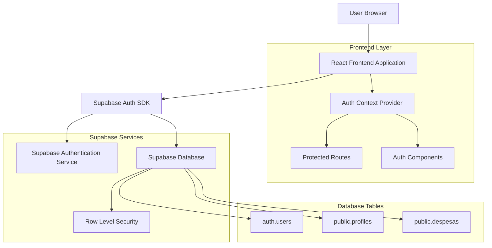
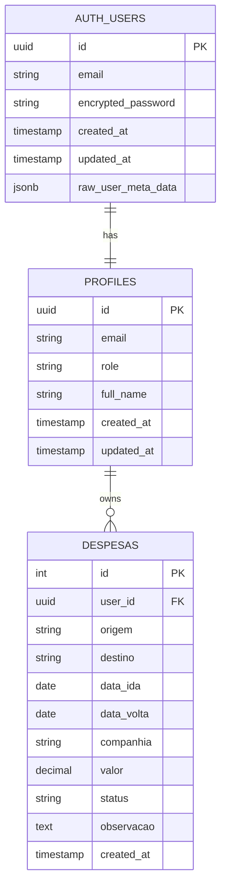

# Arquitetura Técnica - Sistema de Autenticação

## 1. Arquitetura do Sistema



## 2. Stack Tecnológico

**Frontend:**
- React@19.2.0 + TypeScript
- Tailwind CSS@3 para estilização
- Vite como bundler
- React Router DOM para navegação
- Lucide React para ícones

**Backend:**
- Supabase Auth (gerenciamento completo de autenticação)
- Supabase Database (PostgreSQL)
- Row Level Security (RLS) para proteção de dados

**Autenticação:**
- Supabase Auth SDK
- JWT tokens para sessões
- Email/Password authentication
- Password reset via email

## 3. Estrutura de Rotas

| Rota | Propósito | Proteção |
|------|-----------|----------|
| `/` | Página inicial - redireciona baseado na autenticação | Pública |
| `/login` | Página de login | Pública (redireciona se autenticado) |
| `/signup` | Página de registro | Pública (redireciona se autenticado) |
| `/forgot-password` | Recuperação de senha | Pública |
| `/reset-password` | Redefinição de senha | Pública (com token) |
| `/dashboard` | Dashboard principal de viagens | Protegida |
| `/profile` | Perfil do usuário | Protegida |

## 4. Estrutura de Componentes

### 4.1 Componentes de Autenticação

```
src/
├── components/
│   ├── auth/
│   │   ├── LoginForm.tsx          # Formulário de login
│   │   ├── SignupForm.tsx         # Formulário de registro
│   │   ├── ForgotPasswordForm.tsx # Recuperação de senha
│   │   ├── ResetPasswordForm.tsx  # Redefinição de senha
│   │   └── ProfileForm.tsx        # Edição de perfil
│   ├── layout/
│   │   ├── AuthLayout.tsx         # Layout para páginas de auth
│   │   ├── ProtectedLayout.tsx    # Layout para páginas protegidas
│   │   └── Header.tsx             # Header com logout
│   └── ui/
│       ├── Button.tsx             # Componente de botão reutilizável
│       ├── Input.tsx              # Componente de input com validação
│       ├── Alert.tsx              # Componente de alertas
│       └── LoadingSpinner.tsx     # Indicador de carregamento
├── contexts/
│   └── AuthContext.tsx            # Context para gerenciar estado de auth
├── hooks/
│   ├── useAuth.tsx                # Hook personalizado para auth
│   └── useSupabase.tsx            # Hook para operações Supabase
├── services/
│   ├── supabaseClient.ts          # Cliente Supabase configurado
│   └── authService.ts             # Serviços de autenticação
├── types/
│   ├── auth.ts                    # Tipos relacionados à autenticação
│   └── database.ts                # Tipos do banco de dados
└── utils/
    ├── validation.ts              # Funções de validação
    └── constants.ts               # Constantes da aplicação
```

## 5. APIs e Integrações Supabase

### 5.1 Operações de Autenticação

**Login de Usuário**
```typescript
// Método: supabase.auth.signInWithPassword()
interface LoginRequest {
  email: string;
  password: string;
}

interface LoginResponse {
  user: User | null;
  session: Session | null;
  error: AuthError | null;
}
```

**Registro de Usuário**
```typescript
// Método: supabase.auth.signUp()
interface SignupRequest {
  email: string;
  password: string;
  options?: {
    data: {
      full_name?: string;
    }
  }
}

interface SignupResponse {
  user: User | null;
  session: Session | null;
  error: AuthError | null;
}
```

**Recuperação de Senha**
```typescript
// Método: supabase.auth.resetPasswordForEmail()
interface ForgotPasswordRequest {
  email: string;
  options?: {
    redirectTo: string;
  }
}

interface ForgotPasswordResponse {
  error: AuthError | null;
}
```

**Atualização de Senha**
```typescript
// Método: supabase.auth.updateUser()
interface UpdatePasswordRequest {
  password: string;
}

interface UpdatePasswordResponse {
  user: User | null;
  error: AuthError | null;
}
```

### 5.2 Operações de Perfil

**Buscar Perfil do Usuário**
```typescript
// Tabela: profiles
GET /rest/v1/profiles?id=eq.{user_id}

interface ProfileResponse {
  id: string;
  email: string;
  role: 'user' | 'admin';
  full_name?: string;
  created_at: string;
  updated_at: string;
}
```

**Atualizar Perfil**
```typescript
// Tabela: profiles
PATCH /rest/v1/profiles?id=eq.{user_id}

interface UpdateProfileRequest {
  full_name?: string;
  email?: string;
}
```

## 6. Modelo de Dados

### 6.1 Diagrama de Entidades



### 6.2 DDL - Definição das Tabelas

**Tabela de Perfis (profiles)**
```sql
-- Criar tabela de perfis
CREATE TABLE public.profiles (
    id UUID REFERENCES auth.users(id) ON DELETE CASCADE PRIMARY KEY,
    email VARCHAR(255) UNIQUE NOT NULL,
    role VARCHAR(20) DEFAULT 'user' CHECK (role IN ('user', 'admin')),
    full_name VARCHAR(100),
    created_at TIMESTAMP WITH TIME ZONE DEFAULT NOW(),
    updated_at TIMESTAMP WITH TIME ZONE DEFAULT NOW()
);

-- Criar índices
CREATE INDEX idx_profiles_email ON public.profiles(email);
CREATE INDEX idx_profiles_role ON public.profiles(role);

-- Função para atualizar updated_at
CREATE OR REPLACE FUNCTION update_updated_at_column()
RETURNS TRIGGER AS $$
BEGIN
    NEW.updated_at = NOW();
    RETURN NEW;
END;
$$ language 'plpgsql';

-- Trigger para atualizar updated_at automaticamente
CREATE TRIGGER update_profiles_updated_at 
    BEFORE UPDATE ON public.profiles 
    FOR EACH ROW 
    EXECUTE FUNCTION update_updated_at_column();
```

**Atualização da Tabela de Despesas**
```sql
-- Adicionar coluna user_id à tabela existente
ALTER TABLE public.despesas 
ADD COLUMN user_id UUID REFERENCES auth.users(id) ON DELETE CASCADE;

-- Criar índice para performance
CREATE INDEX idx_despesas_user_id ON public.despesas(user_id);
```

### 6.3 Row Level Security (RLS)

**Políticas para Tabela Profiles**
```sql
-- Habilitar RLS na tabela profiles
ALTER TABLE public.profiles ENABLE ROW LEVEL SECURITY;

-- Política: Usuários podem ver apenas seu próprio perfil
CREATE POLICY "Users can view own profile" ON public.profiles
    FOR SELECT USING (auth.uid() = id);

-- Política: Usuários podem atualizar apenas seu próprio perfil
CREATE POLICY "Users can update own profile" ON public.profiles
    FOR UPDATE USING (auth.uid() = id);

-- Política: Permitir inserção de perfil durante registro
CREATE POLICY "Users can insert own profile" ON public.profiles
    FOR INSERT WITH CHECK (auth.uid() = id);

-- Política: Admins podem ver todos os perfis
CREATE POLICY "Admins can view all profiles" ON public.profiles
    FOR SELECT USING (
        EXISTS (
            SELECT 1 FROM public.profiles 
            WHERE id = auth.uid() AND role = 'admin'
        )
    );
```

**Políticas para Tabela Despesas**
```sql
-- Habilitar RLS na tabela despesas
ALTER TABLE public.despesas ENABLE ROW LEVEL SECURITY;

-- Política: Usuários podem ver apenas suas próprias despesas
CREATE POLICY "Users can view own expenses" ON public.despesas
    FOR SELECT USING (auth.uid() = user_id);

-- Política: Usuários podem inserir suas próprias despesas
CREATE POLICY "Users can insert own expenses" ON public.despesas
    FOR INSERT WITH CHECK (auth.uid() = user_id);

-- Política: Usuários podem atualizar suas próprias despesas
CREATE POLICY "Users can update own expenses" ON public.despesas
    FOR UPDATE USING (auth.uid() = user_id);

-- Política: Usuários podem deletar suas próprias despesas
CREATE POLICY "Users can delete own expenses" ON public.despesas
    FOR DELETE USING (auth.uid() = user_id);

-- Política: Admins têm acesso completo
CREATE POLICY "Admins have full access" ON public.despesas
    FOR ALL USING (
        EXISTS (
            SELECT 1 FROM public.profiles 
            WHERE id = auth.uid() AND role = 'admin'
        )
    );
```

### 6.4 Triggers e Funções

**Função para Criar Perfil Automaticamente**
```sql
-- Função para criar perfil quando usuário se registra
CREATE OR REPLACE FUNCTION public.handle_new_user()
RETURNS TRIGGER AS $$
BEGIN
    INSERT INTO public.profiles (id, email, full_name)
    VALUES (
        NEW.id,
        NEW.email,
        NEW.raw_user_meta_data->>'full_name'
    );
    RETURN NEW;
END;
$$ LANGUAGE plpgsql SECURITY DEFINER;

-- Trigger para executar a função após inserção de usuário
CREATE TRIGGER on_auth_user_created
    AFTER INSERT ON auth.users
    FOR EACH ROW EXECUTE FUNCTION public.handle_new_user();
```

## 7. Configurações de Segurança

### 7.1 Configurações do Supabase Auth

**Configurações Recomendadas:**
```json
{
  "SITE_URL": "http://localhost:5173",
  "ADDITIONAL_REDIRECT_URLS": ["http://localhost:5173/auth/callback"],
  "JWT_EXPIRY": 3600,
  "REFRESH_TOKEN_ROTATION_ENABLED": true,
  "SECURITY_REFRESH_TOKEN_REUSE_INTERVAL": 10,
  "PASSWORD_MIN_LENGTH": 8,
  "ENABLE_EMAIL_CONFIRMATIONS": true,
  "ENABLE_EMAIL_CHANGE_CONFIRMATIONS": true,
  "ENABLE_PHONE_CONFIRMATIONS": false
}
```

### 7.2 Validações de Segurança

**Validação de Senha:**
- Mínimo 8 caracteres
- Pelo menos 1 letra maiúscula
- Pelo menos 1 letra minúscula
- Pelo menos 1 número
- Pelo menos 1 caractere especial

**Validação de Email:**
- Formato RFC 5322 válido
- Verificação de domínio existente
- Confirmação obrigatória por email

## 8. Tratamento de Erros

### 8.1 Códigos de Erro Supabase

| Código | Descrição | Ação Recomendada |
|--------|-----------|------------------|
| `invalid_credentials` | Credenciais inválidas | Mostrar erro de login |
| `email_not_confirmed` | Email não confirmado | Reenviar email de confirmação |
| `signup_disabled` | Registro desabilitado | Mostrar mensagem informativa |
| `email_address_invalid` | Email inválido | Validar formato do email |
| `password_too_short` | Senha muito curta | Mostrar requisitos de senha |
| `user_already_registered` | Usuário já existe | Redirecionar para login |

### 8.2 Estratégias de Retry

**Operações de Rede:**
- Retry automático com backoff exponencial
- Máximo 3 tentativas
- Timeout de 10 segundos por tentativa

**Operações de Banco:**
- Retry para erros temporários
- Fallback para cache local quando possível
- Sincronização quando conexão restaurada