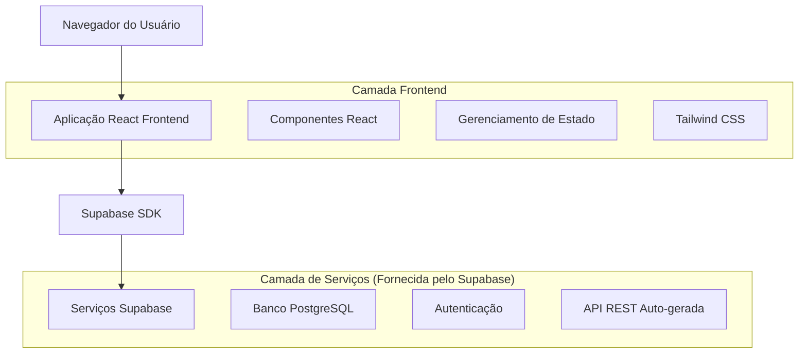
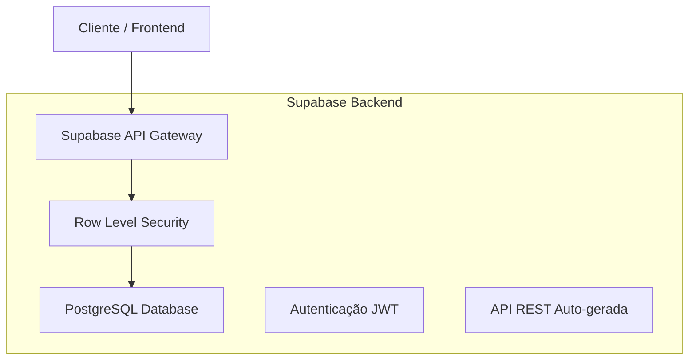
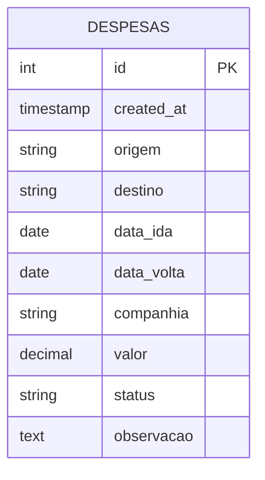

# Documento de Arquitetura Técnica - Sistema de Controle de Viagens

## 1. Design da Arquitetura



## 2. Descrição das Tecnologias

- **Frontend**: React@19.2.0 + TypeScript + Tailwind CSS + Vite
- **Backend**: Supabase (PostgreSQL + API REST + Autenticação)
- **Build Tool**: Vite para desenvolvimento e build otimizado
- **Estilização**: Tailwind CSS para design responsivo

## 3. Definições de Rotas

| Rota | Propósito |
|------|-----------|
| / | Página principal - exibe lista de viagens e funcionalidades principais |

*Nota: Esta é uma Single Page Application (SPA) que utiliza modais para navegação entre funcionalidades.*

## 4. Definições de API

### 4.1 API Principal do Supabase

**Buscar todas as viagens**
```
GET /rest/v1/despesas
```

Resposta:
| Nome do Parâmetro | Tipo | Descrição |
|-------------------|------|-----------|
| id | number | Identificador único da viagem |
| origem | string | Cidade/local de origem |
| destino | string | Cidade/local de destino |
| data_ida | string | Data de ida (ISO format) |
| data_volta | string | Data de volta (ISO format) |
| companhia | string | Companhia aérea/transporte |
| valor | number | Valor da viagem em reais |
| status | string | Status: "Pendente" ou "Comprado" |
| observacao | string | Observações adicionais |
| created_at | string | Data de criação do registro |

**Criar nova viagem**
```
POST /rest/v1/despesas
```

Request:
| Nome do Parâmetro | Tipo | Obrigatório | Descrição |
|-------------------|------|-------------|-----------|
| origem | string | true | Cidade/local de origem |
| destino | string | true | Cidade/local de destino |
| data_ida | string | true | Data de ida |
| data_volta | string | true | Data de volta |
| companhia | string | false | Companhia de transporte |
| valor | number | true | Valor da viagem |
| status | string | true | Status inicial |
| observacao | string | false | Observações |

**Atualizar viagem**
```
PATCH /rest/v1/despesas?id=eq.{id}
```

**Excluir viagem**
```
DELETE /rest/v1/despesas?id=eq.{id}
```

## 5. Arquitetura do Servidor



## 6. Modelo de Dados

### 6.1 Definição do Modelo de Dados



### 6.2 Linguagem de Definição de Dados (DDL)

**Tabela de Despesas (despesas)**
```sql
-- Criar tabela
CREATE TABLE despesas (
    id BIGSERIAL PRIMARY KEY,
    created_at TIMESTAMP WITH TIME ZONE DEFAULT NOW(),
    origem VARCHAR(255),
    destino VARCHAR(255),
    data_ida DATE,
    data_volta DATE,
    companhia VARCHAR(255),
    valor DECIMAL(10,2),
    status VARCHAR(20) CHECK (status IN ('Pendente', 'Comprado')),
    observacao TEXT
);

-- Criar índices para performance
CREATE INDEX idx_despesas_status ON despesas(status);
CREATE INDEX idx_despesas_data_ida ON despesas(data_ida DESC);
CREATE INDEX idx_despesas_created_at ON despesas(created_at DESC);

-- Configurar Row Level Security (RLS)
ALTER TABLE despesas ENABLE ROW LEVEL SECURITY;

-- Política para permitir leitura pública
CREATE POLICY "Permitir leitura pública" ON despesas
    FOR SELECT USING (true);

-- Política para permitir inserção pública
CREATE POLICY "Permitir inserção pública" ON despesas
    FOR INSERT WITH CHECK (true);

-- Política para permitir atualização pública
CREATE POLICY "Permitir atualização pública" ON despesas
    FOR UPDATE USING (true);

-- Política para permitir exclusão pública
CREATE POLICY "Permitir exclusão pública" ON despesas
    FOR DELETE USING (true);

-- Conceder permissões básicas
GRANT SELECT ON despesas TO anon;
GRANT ALL PRIVILEGES ON despesas TO authenticated;
GRANT USAGE ON SEQUENCE despesas_id_seq TO anon;
GRANT USAGE ON SEQUENCE despesas_id_seq TO authenticated;

-- Dados iniciais de exemplo
INSERT INTO despesas (origem, destino, data_ida, data_volta, companhia, valor, status, observacao)
VALUES 
    ('São Paulo', 'Rio de Janeiro', '2024-02-15', '2024-02-18', 'LATAM', 450.00, 'Pendente', 'Viagem de negócios'),
    ('Brasília', 'Salvador', '2024-03-10', '2024-03-15', 'GOL', 380.00, 'Comprado', 'Férias'),
    ('Belo Horizonte', 'Recife', '2024-04-05', '2024-04-12', 'Azul', 520.00, 'Pendente', 'Conferência técnica');
```

## 7. Estrutura de Componentes

### 7.1 Hierarquia de Componentes

```
App.tsx (Componente Principal)
├── Header.tsx (Cabeçalho)
├── LoadingSpinner.tsx (Indicador de carregamento)
├── TravelCard.tsx (Card de viagem individual)
├── AddTripModal.tsx (Modal para adicionar viagem)
└── EditTripModal.tsx (Modal para editar viagem)
```

### 7.2 Tipos TypeScript

```typescript
// Enum para status das viagens
export enum TripStatus {
  Pendente = 'Pendente',
  Comprado = 'Comprado',
}

// Interface principal da viagem
export interface Trip {
  id: number;
  created_at?: string;
  origem: string | null;
  destino: string | null;
  data_ida: string | null;
  data_volta: string | null;
  companhia: string | null;
  valor: number | null;
  status: TripStatus | null;
  observacao: string | null;
}
```

### 7.3 Configuração do Supabase

```typescript
// services/supabaseClient.ts
import { createClient } from '@supabase/supabase-js';

const supabaseUrl = 'https://rgdsuhvocfgotshixxyj.supabase.co';
const supabaseAnonKey = 'eyJhbGciOiJIUzI1NiIsInR5cCI6IkpXVCJ9...';

export const supabase = createClient(supabaseUrl, supabaseAnonKey);
```