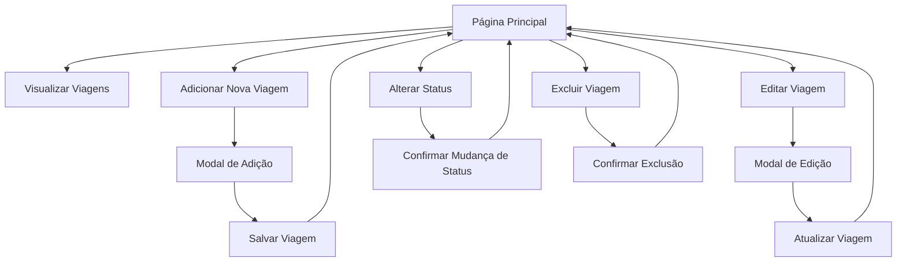

# Documento de Requisitos do Produto - Sistema de Controle de Viagens

## 1. Visão Geral do Produto

Sistema web para gerenciamento e controle de viagens corporativas ou pessoais, permitindo o cadastro, acompanhamento e controle de status de viagens planejadas.

- O sistema resolve o problema de organização e controle de viagens, permitindo que usuários mantenham um registro centralizado de suas viagens com informações detalhadas sobre custos, datas e status de compra.
- Destinado a profissionais que viajam frequentemente, empresas que precisam controlar despesas de viagem, ou pessoas que desejam organizar suas viagens pessoais.

## 2. Funcionalidades Principais

### 2.1 Papéis de Usuário
Não há distinção de papéis - todos os usuários têm acesso completo às funcionalidades do sistema.

### 2.2 Módulos de Funcionalidade

O sistema de controle de viagens consiste nas seguintes páginas principais:

1. **Página Principal**: listagem de viagens, filtros, botão de adicionar nova viagem
2. **Modal de Adição**: formulário para cadastrar nova viagem
3. **Modal de Edição**: formulário para editar viagem existente

### 2.3 Detalhes das Páginas

| Nome da Página | Nome do Módulo | Descrição da Funcionalidade |
|----------------|----------------|----------------------------|
| Página Principal | Cabeçalho | Exibir título do sistema e navegação principal |
| Página Principal | Lista de Viagens | Exibir todas as viagens cadastradas em formato de cards responsivos |
| Página Principal | Cartão de Viagem | Mostrar informações da viagem (origem/destino, datas, companhia, valor, status) com botões de ação |
| Página Principal | Botão Adicionar | Abrir modal para cadastrar nova viagem |
| Página Principal | Indicador de Carregamento | Mostrar spinner durante operações assíncronas |
| Modal de Adição | Formulário de Cadastro | Capturar dados da nova viagem (origem, destino, datas, companhia, valor, observações) |
| Modal de Edição | Formulário de Edição | Permitir alteração de dados de viagem existente |
| Cartão de Viagem | Controle de Status | Alternar status entre "Pendente" e "Comprado" |
| Cartão de Viagem | Ações de Gerenciamento | Editar e excluir viagens com confirmação |

## 3. Processo Principal

### Fluxo Principal do Usuário

1. **Visualização**: Usuário acessa a página principal e visualiza todas as viagens cadastradas
2. **Adição**: Usuário clica em "Adicionar Viagem" → preenche formulário → salva nova viagem
3. **Edição**: Usuário clica no ícone de edição → modifica dados no modal → salva alterações
4. **Controle de Status**: Usuário altera status da viagem entre "Pendente" e "Comprado"
5. **Exclusão**: Usuário clica no ícone de lixeira → confirma exclusão → viagem é removida

## 4. Design da Interface do Usuário

### 4.1 Estilo de Design

- **Cores Primárias**: Azul sky (#0ea5e9) para elementos principais, Verde esmeralda (#10b981) para status "Comprado"
- **Cores Secundárias**: Âmbar (#f59e0b) para status "Pendente", Cinza slate para textos neutros
- **Estilo de Botões**: Botões arredondados com sombras suaves, efeitos hover e transições suaves
- **Fonte**: Sistema padrão com tamanhos variados (text-sm, text-2xl)
- **Layout**: Design baseado em cards com layout responsivo, navegação superior limpa
- **Ícones**: Ícones SVG minimalistas para ações (editar, excluir, calendário, check, etc.)

### 4.2 Visão Geral do Design das Páginas

| Nome da Página | Nome do Módulo | Elementos da UI |
|----------------|----------------|-----------------|
| Página Principal | Cabeçalho | Fundo gradiente azul, título centralizado em branco, tipografia bold |
| Página Principal | Lista de Viagens | Grid responsivo de cards com sombras, hover effects com scale transform |
| Cartão de Viagem | Informações da Viagem | Layout flexível, tipografia hierárquica, badges coloridos para status |
| Cartão de Viagem | Botões de Ação | Ícones circulares com hover states, cores específicas por ação |
| Modal de Adição/Edição | Formulário | Campos de input com bordas arredondadas, labels claros, botões de ação destacados |
| Estados de Loading | Spinner | Animação de rotação suave, indicadores visuais durante operações |

### 4.3 Responsividade

O sistema é mobile-first e totalmente responsivo:
- **Desktop**: Layout em grid com múltiplas colunas para os cards
- **Tablet**: Adaptação automática do grid para 2 colunas
- **Mobile**: Layout em coluna única com elementos empilhados
- **Touch**: Otimizado para interação touch com áreas de toque adequadas
- **Breakpoints**: Utiliza sistema de breakpoints do Tailwind CSS (sm, md, lg, xl)