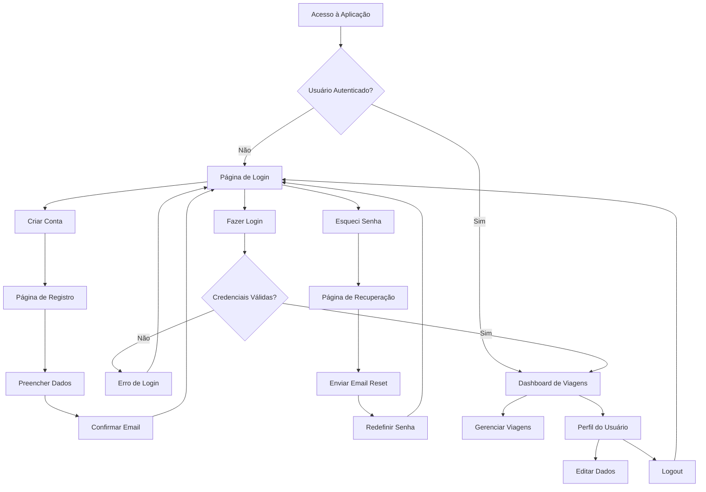

# PRD - Sistema de Autenticação para Controle de Viagens

## 1. Visão Geral do Produto

Sistema de autenticação integrado ao aplicativo de controle de viagens, fornecendo acesso seguro e personalizado às funcionalidades de gerenciamento de despesas de viagem. O sistema utiliza Supabase Auth para garantir segurança robusta e experiência de usuário fluida.

- **Objetivo Principal**: Proteger o acesso às funcionalidades de controle de viagens através de autenticação segura por email/senha
- **Público-Alvo**: Usuários que necessitam gerenciar suas viagens de forma privada e segura
- **Valor do Produto**: Segurança de dados pessoais e controle de acesso individualizado às informações de viagem

## 2. Funcionalidades Principais

### 2.1 Papéis de Usuário

| Papel | Método de Registro | Permissões Principais |
|-------|-------------------|----------------------|
| Usuário Padrão | Registro por email | Acesso completo às próprias viagens, perfil pessoal |
| Administrador | Upgrade manual no banco | Acesso a todas as viagens, gerenciamento de usuários |

### 2.2 Módulos de Funcionalidade

O sistema de autenticação consiste nas seguintes páginas principais:

1. **Página de Login**: formulário de autenticação, link para registro, recuperação de senha
2. **Página de Registro**: formulário de criação de conta, validações em tempo real, confirmação por email
3. **Página de Recuperação de Senha**: formulário de reset, confirmação por email, redefinição segura
4. **Página de Perfil**: visualização e edição de dados pessoais, alteração de senha
5. **Dashboard Protegido**: acesso às funcionalidades existentes de controle de viagens

### 2.3 Detalhes das Páginas

| Nome da Página | Módulo | Descrição da Funcionalidade |
|----------------|--------|----------------------------|
| Login | Formulário de Autenticação | Validar credenciais, manter sessão, redirecionamento automático, feedback visual de erros |
| Registro | Formulário de Cadastro | Criar nova conta, validação de email único, confirmação por email, políticas de senha |
| Recuperação | Reset de Senha | Enviar email de recuperação, validar token, redefinir senha com segurança |
| Perfil | Gerenciamento de Conta | Visualizar dados pessoais, editar informações, alterar senha, logout seguro |
| Dashboard | Área Protegida | Acesso às funcionalidades de viagem após autenticação bem-sucedida |

## 3. Fluxo Principal de Usuário

### 3.1 Fluxo de Autenticação

**Novo Usuário:**
1. Acessa a aplicação → Redirecionado para Login
2. Clica em "Criar Conta" → Página de Registro
3. Preenche dados e submete → Recebe email de confirmação
4. Confirma email → Conta ativada
5. Faz login → Acesso ao Dashboard de Viagens

**Usuário Existente:**
1. Acessa a aplicação → Página de Login
2. Insere credenciais → Validação automática
3. Login bem-sucedido → Dashboard de Viagens
4. Sessão mantida → Acesso direto em próximas visitas

**Recuperação de Senha:**
1. Na página de Login → Clica "Esqueci minha senha"
2. Insere email → Recebe link de recuperação
3. Clica no link → Página de redefinição
4. Define nova senha → Redirecionado para Login

### 3.2 Diagrama de Fluxo

## 4. Design da Interface

### 4.1 Estilo de Design

**Elementos Principais:**
- **Cores Primárias**: Azul (#3B82F6), Azul Escuro (#1E40AF)
- **Cores Secundárias**: Cinza Claro (#F8FAFC), Cinza Médio (#64748B), Cinza Escuro (#1E293B)
- **Tipografia**: Inter (font-family), -6 letter-spacing para títulos
- **Botões**: Estilo arredondado (rounded-lg), sombras suaves, transições de 300ms
- **Layout**: Design centrado, cards com sombras, espaçamento generoso
- **Ícones**: Lucide React, estilo outline, 20px para formulários

### 4.2 Visão Geral do Design das Páginas

| Nome da Página | Módulo | Elementos de UI |
|----------------|--------|-----------------|
| Login | Formulário Central | Card centralizado, campos com ícones, botão primário azul, links secundários, animações de erro |
| Registro | Formulário Expandido | Layout similar ao login, validação em tempo real, indicador de força da senha, termos de uso |
| Recuperação | Formulário Simples | Card minimalista, campo de email, instruções claras, feedback de sucesso |
| Perfil | Dashboard Lateral | Sidebar com navegação, área principal editável, botões de ação, modal de confirmação |
| Dashboard | Layout Completo | Header com logout, área principal preservada, indicador de usuário logado |

### 4.3 Responsividade

**Estratégia Mobile-First:**
- Breakpoints: sm (640px), md (768px), lg (1024px)
- Cards adaptáveis com padding responsivo
- Formulários com largura máxima de 400px
- Navegação colapsável em dispositivos móveis
- Touch-friendly com áreas de toque mínimas de 44px

## 5. Estados e Animações

### 5.1 Estados de Feedback

**Estados de Sucesso:**
- Animação de fade-in verde suave
- Ícone de check com animação de escala
- Mensagem temporária com auto-dismiss (3s)

**Estados de Erro:**
- Animação de shake nos campos inválidos
- Borda vermelha com transição suave
- Mensagem de erro com slide-down
- Ícone de alerta com pulsação sutil

**Estados de Loading:**
- Spinner animado nos botões
- Skeleton loading para formulários
- Overlay translúcido durante operações
- Desabilitação visual de elementos interativos

### 5.2 Micro-animações

- **Hover**: Elevação de botões (transform: translateY(-1px))
- **Focus**: Outline azul com transição suave
- **Input**: Animação de label flutuante
- **Modal**: Fade-in com backdrop blur
- **Transições**: 300ms ease-in-out para todas as interações